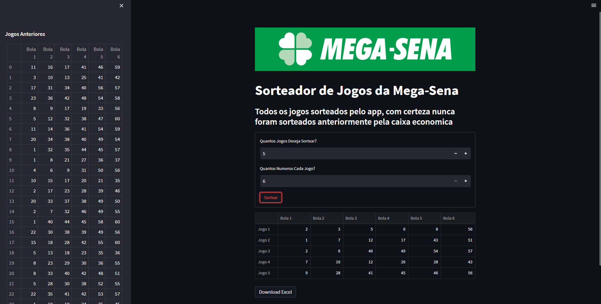

# Mega-Sena Games Sorter

Megasena é um jogo de apostas brasileiro feito pela caixa ecônomica onde 6 numeros entre 1 e 60 são sorteados. 

Acesse em: https://mega-sena-game-sorter.streamlit.app/

## Objetivo

O objetivo desse app é analisar todos os jogos anteriores (disponivel na planilha "mega_sena.xlsx") e sortear N jogos garantindo que cada novo jogo sorteado não tem 4 numeros em comum com algum jogo sorteado anteriormente.

## Tecnologias Utilizadas
Foi utilizado o pandas e o streamlit para criar o jogo

- Pandas:
> Para o processamento de dados e manipulação dos jogos sorteados anteriormente

- Streamlit:
> Para a interface bonita e interativa.

## Rodando Localmente
- Clone o projeto
> `git clone https://github.com/davi-lucciola/MegaSenaGamesSorter.git`

- Instale as depêndencias
> `pip install -r requiriments.txt`

- Execute com o comando 
> `streamlit run main.py`
